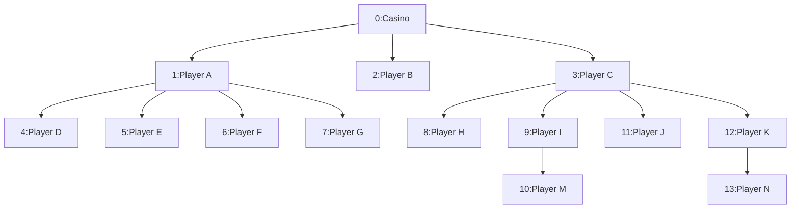

# The High Roller Network

## The network

The application consists of building a system to create the hierarchical relationships of the high roller's network in a casino.

## The structure of the network

In the casino, every player is a node and might refer another player:

* The Casino (root node, ID: 0)
* High Rollers (parent nodes) bring in their referrals.
* Regular players (child nodes) bring in their referrals.
* New players (leaf nodes) just join the network.

Here's how the current network looks:



## The goals

Design the API service that can manage the entire player's network.
The requirements are:

1. Welcome new players to the network
    * Add new players under their referrers.
    * Track who brought whom to the casino.
    * Maintain the referral chain integrity.
2. Player leave the network
    * Handle what happens if a player leaves the network.
3. Reassignment of the referrer
    * Transfer players among them.
    * Update referral chains without losing history.
4. Network Tracking
    * Given any player in the network, get their entire downline.

## Examples of tracking on the network

1. Get all players, must return in this order:

    ```text
    [ Casino, Player A, Player D, Player E, Player F, Player G, Player B, Player C, Player H, Player I, Player M, Player J, Player K, Player N ]
    ```

2. Get the downline of "Player A":

    ```text
    [ Player A, Player D, Player E, Player F, Player G ]
    ```

3. Get the downline of "Player B":

    ```text
    [ Player B ]
    ```
